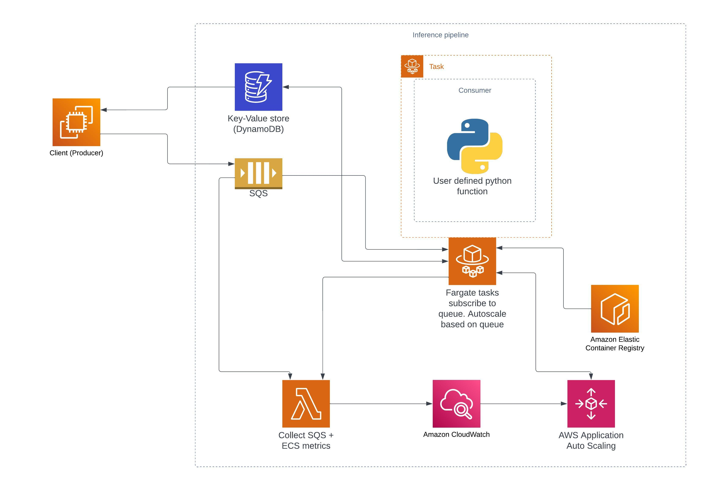

# BNSSG CT (THIS IS WORK IN PROGRESS)

Scalable async compute using SQS, DynamoDB & ECS.

## What's included
- Python packages encapsulating Producer + Consumer for scalable queue based ML inference
- Terraform IAC definition to bring up the required AWS resources quickly
- Autoscaling of Fargate ECS based on Queue length metric(s)

## Architecture
An architecture diagram can be found below:



Alternatively an editable lucidchart can be found [here](https://lucid.app/lucidchart/780efb72-9dee-4d29-a6ac-96a58ba503d0/edit?viewport_loc=-280%2C-97%2C3512%2C1438%2CIIiXcRaXa~YW&invitationId=inv_98fc6807-3315-41fb-9c01-100ff9ef6e4e)

The solution uses the following components:
- SQS
- ECS + Fargate
- Lambda - for computing cloudwatch metrics for autoscaling
- Cloudwatch alarms

The system works on a queue based system (backed by AWS SQS) and follows a Producer & Consumer architecture.
The Producer is responsible for sending messages to the queue and can be used, for example in small APIs or other systems to send jobs out to the inference pipeline.
The Consumer processes those messages and runs on ECS. The Consumer expects a user supplied python function, defining the compute job.


### Autoscaling of ECS
As part of the Terraform stack components to handle autoscaling are also included.
This is based off of  https://github.com/dailymuse/terraform-aws-ecs-queue-backlog-autoscaling.


## Example usage

### Consumer
The consumer consumes messages from the queue. When it receives a message it will run the user defined execution function. The result of the computation will be written to a DynamoDB table. For example
```python
InT = Any  # Must be json.dumps-able
OutT = Any  # Must be json.dumps-able

def your_function(body: InT, message_id: str) -> OutT:
    number = body["number"]
    # processing goes here
    return {"answer": 42}


consumer = Consumer(
    queue_name="sqs_queue_name.fifo",
    ddb_client=DynamoDBClient(table="ddb_table"),
    compute_result=your_function,
)
consumer.start_consuming()
```

### Producer
The producer puts messages onto the queue in order that they can be processed by the Consumer.
```python
producer = Producer(
    queue_name="sqs_queue_name.fifo",
    ddb_client=DynamoDBClient(table="ddb_table"),
)
```

A job can be submitted
```python
body: InT = {"number": 4}
id_ = producer.post_non_blocking(body)
```
this id corresponds to the SQS message id and can be used to poll the status of the job and collect the result when it's ready:
```python
timeout = time.time() + producer.timeout_seconds
while time.time() < timeout:
    status = producer.retrieve_result_status(id_)
    if status == ResultStatus.SUCCESS:
        break
else:
    raise TimeoutError("Timeout reached.")

resp = producer.retrieve_result(id_)
result = resp.result
assert result == your_function(body, id_)
```

Alternatively, the above is encapuslated in a blocking method:
```python
result = producer.post(id_).result
```

## API reference
API reference is auto-generated by the CI and is hosted via github pages


## Infrastructure (Terraform)
Note this repo provides two terraform stacks. Due to the way current Frontier is deployed, there is only a single VPC shared between prod & staging environments. Since it is preferable to use VPC endpoints for DynamoDB and SQS it brings an issue, because those endpoints need to be created per VPC. I.e. the endpoints are shared between prod & staging. Therefore we need a separate terraform stack to deploy those. This is found in the `terraform/endpoints` folder. These should only need to be configured once, therefore that has not yet been added to the CI/CD template. The `inference_pipeline` terraform stack then expects to have the used `subnet_ids` & SQS VPC endpoint id passed in as a variable.

To deploy the `endpoints` stack:
```bash
cd terraform/endpoints
terraform validate
terraform plan
terraform apply
```
Some of the outputs of the `endpoints` stack need to be fed into the main `infra` as terraform variables. The relevant outputs are the SQS VPC endpoint:
```bash
terraform output --json | jq '.vpc_endpoints.value.sqs'
```
and the ids of the VPC subnets used:
```bash
terraform output --json | jq '.subnet_ids.value'
```
In the `infra` stack, these become the `sqs_vpc_endpoint_id` & `subnet_ids` variables, respectively.

## Development

### pre-commit
To install
```bash
pip install pre-commit
pre-commit install
```

### Run tests locally
Tests are run against local version of DynamoDB & SQS. To start, run
```bash
docker-compose up dynamodb-local dynamodb-admin sqs
```
Then, the tests can be run using
```bash
pytest tests
```

### Linting
```bash
pre-commit run --all-files
```

### Run example
The example can be run locally in docker-compose. To start the consumer service, run
```bash
docker-compose up --build --timeout 60
```

A message can be send to the SQS queue, which should be picked up by the service:
```bash
cd example
DOTENV_FILE=local.env python send_message.py
```

### Run e2e test from local machine against staging
An E2E test is supplied, that is intended to run against the staging environment after each terraform apply, to check the deployment integration.
Assuming that you are already logged into AWS, run
```bash
pytest -rA e2e_test/test.py
```

### Generate New Requirements Files
To generate update requirements files
```bash
./scripts/make_requirements.txt
```
or, to generate fresh ones
```bash
./scripts/make_requirements.txt -fresh
```

## TODOS
- Write docs
- ~Terraform module~
- ~Add a ResultStatus.SUBMITTED flag that signals result submitted but not yet picked up IN_PROGRESS~
- ~Migrate to loguru~
- ~Write better doc string~
- ~Autoscaling https://github.com/dailymuse/terraform-aws-ecs-queue-backlog-autoscaling/tree/2.4.0/examples/sqs-scaling ~
- Remove egress all in favour of VPC endpoints for ECR: https://docs.aws.amazon.com/AmazonECR/latest/userguide/vpc-endpoints.html
- Cloudwatch alarms in terraform
- Fully migrate from gitlab CI to github
